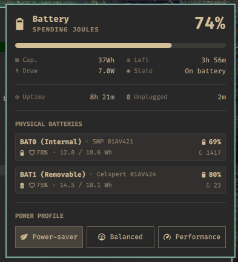

# Omarchy Battery Monitor Plugin

> One clear power view for every battery in your Omarchy laptop.

[](LICENSE)
[](https://omarchy.org/)



Built for dual-battery ThinkPads and other UPower laptops. See the combined
picture at a glance, then inspect each physical battery when you need detail.

## Highlights

- Combined charge, capacity, power rate, and time estimate in the bar
- Per-battery health, energy, cycles, percentage, and state in the panel
- A `Plugged` notification when the charger connects, and an `Unplugged`
  notification with the session summary when it disconnects
- Charging and on-battery session timing
- Built-in power-profile controls
- User-level installation with no root service
- Hidden automatically on desktops with no laptop battery, and refused at
  install time on the same hardware

## Install

```sh
git clone https://github.com/pradyumnac/omarchy-battery-monitor-plugin.git
cd omarchy-battery-monitor-plugin
make install
```

Full install, uninstall, and troubleshooting steps:
[docs/user/install.md](docs/user/install.md).

## Status

```sh
make status
```

This is the single operational report: color-coded service health, raw tracker
state, and battery-intelligence learning/history progress. The intelligence
section reports `Usual` readiness as capped `X/12 windows` and `Y/3 sessions`
counters. Colors are enabled on a terminal, disabled with `NO_COLOR=1 make status`, and
can be forced through a pipe with `BATTERY_STATUS_COLOR=always make status`.

## Learn more

| Doc | For |
| --- | --- |
| [docs/user/install.md](docs/user/install.md) | Install, uninstall, troubleshooting |
| [docs/user/notifications.md](docs/user/notifications.md) | What the panel and each notification mean |
| [docs/dev/architecture.md](docs/dev/architecture.md) | The tracker/monitor state machine, for contributors |
| [docs/dev/state-file-reference.md](docs/dev/state-file-reference.md) | State file field reference |
| [docs/dev/requirements-spec.md](docs/dev/requirements-spec.md) | Test coverage, manual QA checklist, backlog |

## Repo map

| Path | What's there |
| --- | --- |
| `Panel.qml`, `Model.js`, `manifest.json` | The Omarchy bar widget |
| `service/` | The tracker, the monitor, and their systemd units — installed and run long-term |
| `scripts/` | `install`/`uninstall`/`preflight` — one-shot, run by `make` |
| `tests/` | Node test suite (`make test`) |
| `docs/user/` | End-user docs: install, uninstall, notifications |
| `docs/dev/` | Contributor docs: architecture, state file, requirements spec |

## Constraints

- Keep runtime state, host paths, credentials, serials, and personal data out
  of Git.
- Write files only below the current user's home directory, including tests
  and configurable install/state paths.
- Keep the plugin desktop-safe. Do not require root or edit
  `/usr/share/omarchy`.

## Contributing

See [CONTRIBUTING.md](CONTRIBUTING.md) for the contribution process
(includes `make check` / `make install` / `make uninstall`).

## License

MIT — see [LICENSE](LICENSE).
