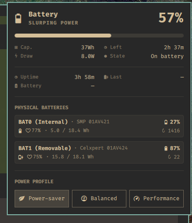

# Omarchy Battery Monitor Plugin

> A focused Omarchy/Quickshell power panel for ThinkPad T480-style laptops and other systems with UPower laptop batteries.

[](LICENSE)
[](https://omarchy.org/)

## What it looks like



## What it does

- Shows combined battery capacity, rate, and remaining-time estimates
- Shows each physical battery's health, energy, cycles, percentage, and state icon
- Provides laptop-only power-profile controls
- Shows uptime and current `On battery` / `On charge` duration
- Tracks real AC ↔ battery transitions with a persistent user-level timer
- **Polls power state every 30 seconds; session times are approximate by up to one polling interval**
- Hides battery UI on desktops without laptop batteries

See [battery session behavior](docs/battery-session-behavior.md) for charger,
dual-battery, threshold, polling-delay, and failure scenarios.

UPower history is sampled data rather than an event log. The session tracker avoids presenting a recent sample as a false “last charge” event.

## Install

The public repository has one supported installation entry point: `make install`.

```sh
git clone https://github.com/pradyumnac/omarchy-battery-monitor-plugin.git
cd omarchy-battery-monitor-plugin
make install
```

`make install` copies the plugin to `~/.config/omarchy/plugins/doe.power`, installs the user systemd timer, and starts it. The tracker polls every **30 seconds**, so charger transition times can be delayed by up to one polling interval. It is safe to run repeatedly. Set `PLUGIN_DIR` to use another plugin location.

Reload Omarchy after installation:

```sh
omarchy-shell shell rescanPlugins
omarchy restart shell
```

## Requirements

- Omarchy with Quickshell
- UPower and `systemctl --user`
- Node.js for checks
- A Nerd Font available to the Omarchy shell

## Development

```sh
make check
make status
```

Test AC connected, AC disconnected, threshold/fully-charged states, one battery, two batteries, and a desktop without laptop batteries. Keep runtime state out of Git.

**Open verification issue:** Confirm on supported laptops that mains supplies expose `type=Mains` and that USB-C and alternate AC adapters produce correct transitions. Do not close this issue until hardware verification is complete.

## Repository layout

| File | Purpose |
| --- | --- |
| `Panel.qml` | Quickshell widget and panel UI |
| `Model.js` | Formatting and battery aggregation helpers |
| `tracker/battery-session-tracker` | Persistent user-level transition poller |
| `tracker/*.service` / `*.timer` | User systemd integration |
| `tracker/install-session-tracker` | Internal installer used by `make install` |
| `CONTRIBUTING.md` | Contribution and testing guide |
| `docs/battery-session-behavior.md` | Charger and battery session behavior reference |

## Privacy

No host-specific configuration or runtime state is tracked. Runtime state is stored under `~/.local/state/battery-session/`.

## Contributing

See [CONTRIBUTING.md](CONTRIBUTING.md) and [CONTRIBUTORS.md](CONTRIBUTORS.md). Pull requests for portability, accessibility, and Omarchy compatibility are welcome.

## License

MIT — see [LICENSE](LICENSE).
