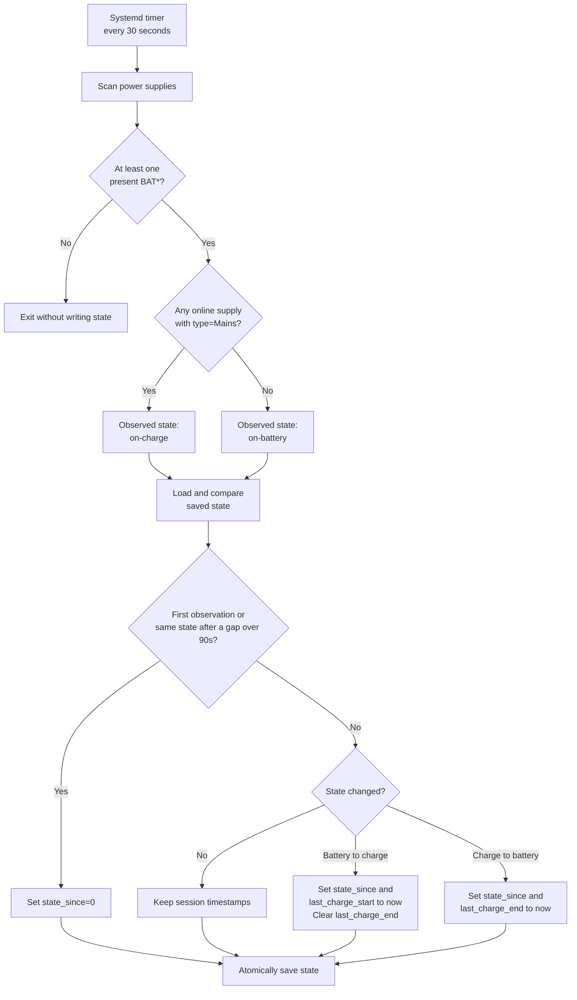
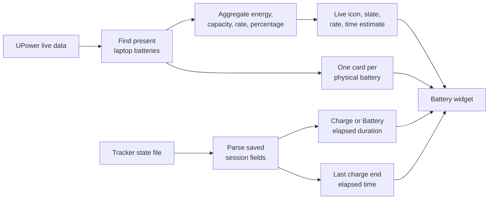

<!-- markdownlint-disable MD013 -->

# Battery session behavior

> **Timing:** Live battery data comes from UPower. Session history comes from a
> 30-second poller. A recorded transition can be up to 30 seconds late.

## System flow



## Widget data flow



## Scenario map

| Event or condition | What is saved | What the widget displays | Delay |
| --- | --- | --- | --- |
| First run while charging | `previous_state=on-charge`, `state_since=0` | Live state shows charging. `Charge` is `—` until a transition is observed. | Live data first; state within 30s |
| First run on battery | `previous_state=on-battery`, `state_since=0` | Live state shows on battery. `Battery` is `—` until a transition is observed. | Live data first; state within 30s |
| Charger connects after observed battery use | `state_since=now`, `last_charge_start=now`, `last_charge_end=0` | `Charge` counts from the observed connection. `Last` is `—`. | Up to 30s |
| Charger remains connected | Existing session start is preserved; `last_observed` advances | `Charge` continues to increase. | Widget refresh |
| Charger is removed | `state_since=now`, `last_charge_end=now` | `Battery` counts from removal. `Last` shows time since charging ended. | Up to 30s |
| Battery use continues | Existing session start and charge end are preserved | `Battery` and `Last` continue to increase. | Widget refresh |
| Charger reconnects | New charge start is saved; `last_charge_end=0` | `Charge` restarts. `Last` clears to `—`. | Up to 30s |
| Same state after a gap over 90s | `state_since=0` | Current session duration is `—`; continuity is unknown. | Next poll |
| State differs after a gap over 90s | A transition is recorded at the next observation | Duration starts at that observation, not at the unknown real event time. | Next poll |
| One present battery | One system session plus one battery card | Live totals use that battery. | Live |
| Two present batteries | One system session; no per-battery session timestamps | Totals combine both batteries. Each battery has its own card. | Live |
| One battery is held by a threshold | Session still follows mains state | The held battery can say `Not charging` while the system remains on charge. | Live |
| No present `BAT*` battery | No state file is written | The laptop battery widget is hidden. | Live |
| Empty refresh payload | Existing state file is unchanged | The widget keeps its last valid payload where guarded. | Until valid refresh |

## Saved state

Default path:

```text
${XDG_STATE_HOME:-$HOME/.local/state}/battery-session/state
```

| Field | Written when | Meaning | Widget use |
| --- | --- | --- | --- |
| `previous_state` | Every successful poll | Last observed `on-charge` or `on-battery` state | Selects session interpretation and hides `Last` while charging |
| `state_since` | On a confirmed transition; reset after unknown continuity | Start of the current observed state, or `0` | Primary source for `Charge` or `Battery` duration |
| `last_charge_start` | On battery-to-charge transition | Last observed charging start | Fallback for `Charge` duration |
| `last_charge_end` | On charge-to-battery transition; cleared on reconnect | Last observed charging end, or `0` | Source for `Last` while on battery |
| `last_observed` | Every successful poll | Last tracker observation time | Detects clock reversal or a gap over 90 seconds |

> **One session, many batteries:** Session history describes the laptop's mains
> connection. It is not stored separately for BAT0 and BAT1.

<!-- Separate notes intentionally. -->

> **Observed, not exact:** `now` is the poll time. It is not the exact physical
> plug or unplug time.

## Display rules

| Widget row | Charging | On battery | Unknown session start |
| --- | --- | --- | --- |
| State | `Charging`, `Full`, or threshold/holding state | `On battery` | Live UPower state still displays |
| Session | `Charge <elapsed>` | `Battery <elapsed>` | `—` |
| Last | `—` | `<elapsed> ago` after a recorded charge end | `—` if no charge end exists |
| Combined level | Aggregated present laptop batteries | Aggregated present laptop batteries | Unaffected |
| Physical cards | One card for each present battery | One card for each present battery | Unaffected |

## Current test map

| Behavior | Automated coverage | Test location |
| --- | --- | --- |
| Alternate mains name with `type=Mains` | Yes | `tests/tracker.test.js` |
| Battery-to-charge transition | Yes | `tests/tracker.test.js` |
| Charge-to-battery transition | Yes | `tests/tracker.test.js` |
| Reconnect clears `last_charge_end` | Yes | `tests/tracker.test.js` |
| Same-state gap over 90 seconds | Yes | `tests/tracker.test.js` |
| Desktop without a battery | Yes | `tests/tracker.test.js` |
| Two-battery aggregation | Yes, model-level | `tests/model.test.js` |
| Threshold calculations | Yes, model-level | `tests/model.test.js` |
| State-file `key=value` parsing | Yes | `tests/model.test.js` |
| Exact widget labels for each transition | No | Runtime QML check required |
| State change after a gap over 90 seconds | No | Candidate for the next test iteration |
| One battery absent in a two-battery laptop | No | Candidate for the next test iteration |
| Real T480 AC and USB-C supplies | Manual/community verification | Supported hardware required |

## Visual assets

The Mermaid diagrams above render as images on GitHub. Runtime screenshots can
be added under [`docs/images/`](images/) without mixing them with root-level
release screenshots. The image guide defines suggested filenames and content.

## Short operational notes

- Open panels refresh displayed process data every 5 seconds.
- The tracker writes state every 30 seconds.
- Live UPower state can change before session history changes.
- Closing and reopening the panel reads the latest tracker state.
- Runtime state and hardware identifiers must not be committed.
