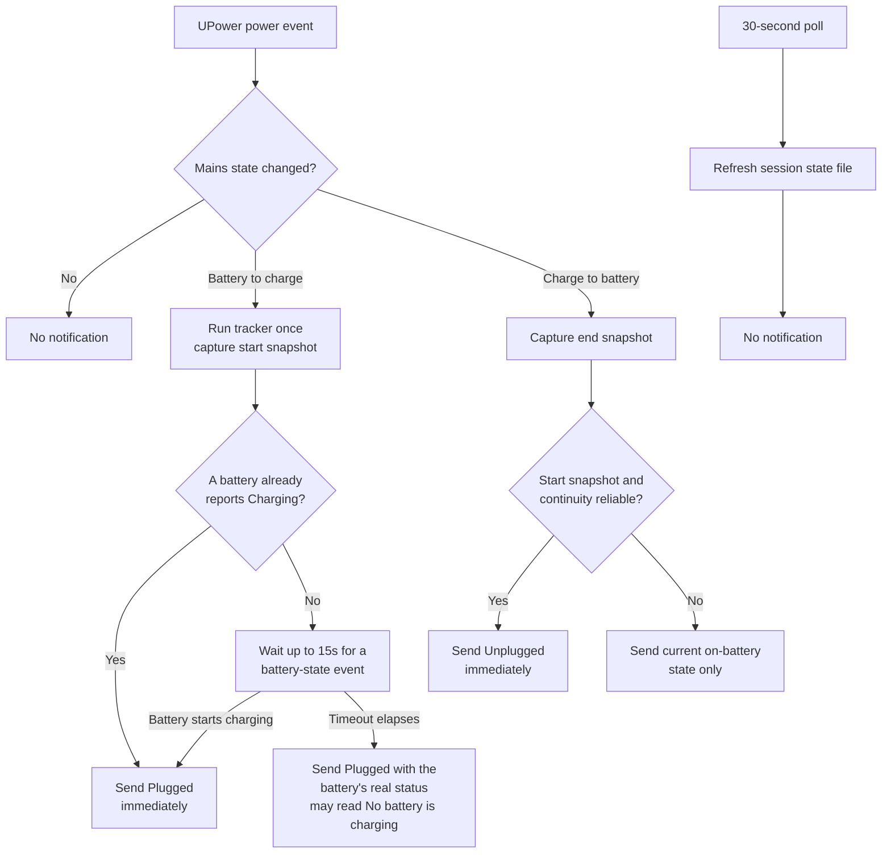

<!-- markdownlint-disable MD013 -->

# Charging session experience

> **Purpose:** This document describes how the plugin tracks and reports
> charging sessions. It is the single reference for the behavior — for end
> users who want to know what a notification means, and for developers who
> change the tracker or the panel.

The panel and the notifications use two different data sources:

- **UPower events** drive every notification. A notification appears only
  when the charger connects or disconnects.
- **A 30-second poll** keeps the panel's session numbers fresh between
  events. The poll never sends a notification. It only updates the state
  file that the panel reads.

Because of the poll, a duration shown in the panel can lag the real state by
up to 30 seconds. Notifications do not have this lag.

## What you see

| Event | Notification | Panel after the event |
| --- | --- | --- |
| Charger connects | `Plugged`, with the battery that is charging and its percentage. | Bar shows the combined percentage. Panel shows charging details. |
| Charger disconnects | `Unplugged`, with the session duration and one start-to-end row per battery. | Panel shows on-battery details and one `Unplugged` duration. |
| A fact is not known | The notification shows only known facts. | The panel shows `—` for the unknown value. |

## Notifications

A notification answers one question first: **what changed?** It does not
repeat every number the panel already shows.

### Charger connected

```text
Plugged
BAT0 · 22%
```

- **Title:** `Plugged`.
- **Body:** one row per battery that is actively charging, with its
  percentage.

If two batteries charge at once, each gets its own row. A battery held at
its charge threshold does not appear as charging. If no battery is charging
yet — for example, a battery already above its charge threshold — the body
reads `No battery is charging`.

The notification does not show aggregate pack level, charge rate, or time
to full. The panel already shows those; the notification only reports the
event.

### Charger disconnected

```text
Unplugged
Charged for ~18m
BAT0: 12% → 22%
BAT1: 80% → 80%
```

- **Title:** `Unplugged`.
- **First row:** approximate session duration.
- **Battery rows:** one start-to-end percentage per battery.

The start and end values speak for themselves. The notification does not
add a calculated gain next to them. Duration carries a `~` because the
timestamps behind it are approximate.

## Rules for every notification

- One short title and one scannable fact per row.
- On plug, list only batteries that are actively charging.
- On unplug, show duration first, then one row per battery.
- List only present laptop batteries — never a UPS or AC adapter entry.
- Name batteries `BAT0`, `BAT1`, and so on. Never show a serial number or
  another host-specific ID.
- Omit a value that is not known. Do not show a misleading zero.
- Never repeat a notification while the observed power state stays the
  same.

## Batteries added or removed mid-session

| Case | Connection notification | Disconnection summary |
| --- | --- | --- |
| One battery | Its name and current percentage. | Its start and end percentages. |
| Two batteries charging | Each battery on its own row. | Each battery's start and end percentages on its own row. |
| One charging, one held at threshold | Only the charging battery. | Both rows; equal start and end values already show no change. |
| Battery present at session start only | Shown at connection. | Row reads `removed`, with its start level. No invented end value. |
| Battery present at session end only | Not part of the connection snapshot. | Row reads `added`, with its end level. No invented start value. |
| No laptop battery | No notification is sent. | The panel stays hidden. |

A charging session belongs to the laptop's mains connection, not to one
battery. The per-battery rows show how that one session affected each
physical battery.

## How a session is tracked



The 15-second wait exists for one reason: a battery already above its
charge threshold never reports `Charging`. Without the wait, the plug
notification would fire before UPower updates the battery's status, and
could wrongly say no battery is charging even when one is about to start.
The wait gives UPower a chance to report the real status first, and the
timeout guarantees a notification still arrives if that battery never
starts charging.

## Scenario map

| Event or condition | What is saved | What is shown | Delay |
| --- | --- | --- | --- |
| First observation, charging | Current state; session start unknown | Live charging state; duration `—` | Live data first; state settles within 30s |
| First observation, on battery | Current state; session start unknown | Live on-battery state; duration `—` | Live data first; state settles within 30s |
| Battery-to-charge transition | Charge start and per-battery start snapshot | `Plugged` notification; panel's `Plugged` duration starts | UPower event |
| Charging continues | Existing start kept; latest observation advances | `Plugged` duration and live numbers continue | Panel refresh |
| Charge-to-battery transition | Charge end, duration, per-battery end snapshot | `Unplugged` notification; panel's `Unplugged` duration starts | UPower event |
| On battery continues | Existing charge end kept | `Unplugged` duration continues | Panel refresh |
| Charger reconnects | New start snapshot; previous end clears | New `Plugged` notification and duration | UPower event |
| Same state after a gap over 90s | Current session start becomes unknown | Duration `—`; no historical claim | Next poll |
| Different state after an unknown gap | Current state known; exact transition and duration are not | Current-state notification only; no wrap-up delta | Next poll |
| Empty poll payload | Existing valid data stays | Last valid values stay on screen | Until the next valid poll |

## State file reference

Everything above reads and writes one file:

```text
${XDG_STATE_HOME:-$HOME/.local/state}/battery-session/state
```

`battery-session-tracker` writes it. `battery-session-monitor` triggers it
on power events. The panel reads it every refresh.

| Field | Meaning | Used for |
| --- | --- | --- |
| `previous_state` | Last observed state: `on-charge` or `on-battery` | Chooses the `Plugged` or `Unplugged` panel label |
| `state_since` | Start of the current observed state, or `0` | Panel's session duration |
| `last_charge_start` | Last observed battery-to-charge transition | Fallback source for `Plugged` duration |
| `last_charge_end` | Last observed charge-to-battery transition, or `0` | Marks the session end; not shown separately |
| `last_observed` | Time of the last successful poll | Detects a clock reversal or a gap over 90 seconds |
| `charge_start_levels` | Per-battery percentage at charge start | Produces one start-to-end row per battery on unplug |
| `charge_session_valid` | Whether continuity and the start snapshot are reliable | Blocks an invented duration or delta |

The file holds only `BAT*` names, percentages, presence, and timestamps —
never a serial number, model ID, or other host-identifying data. Every
write is atomic (write to a temp file, then rename) and user-only
(`umask 077`), the same as the rest of the tracker's state.

### The two scripts that write it

| Script | Runs | Job |
| --- | --- | --- |
| `battery-session-tracker` | Every 30s (`battery-session-tracker.timer`), and once on every power event | Reads sysfs, updates the state file, and — only when called with `--power-event` — sends the notification |
| `battery-session-monitor` | Continuously, as a `battery-session-monitor.service` | Watches `upower --monitor`, decides when a transition is real, and calls the tracker with `--power-event` |

`battery-session-tracker` never notifies on its own poll. Only
`battery-session-monitor` passes `--power-event`, so a notification always
traces back to a real UPower event, never to the fallback poll.

## Test coverage

| Behavior | Covered by |
| --- | --- |
| Alternate mains supply name, `type=Mains` | `tests/tracker.test.js` |
| Battery-to-charge transition | `tests/tracker.test.js` |
| Charge-to-battery transition | `tests/tracker.test.js` |
| Reconnect clears `last_charge_end` | `tests/tracker.test.js` |
| Same-state gap over 90 seconds | `tests/tracker.test.js` |
| Desktop with no battery creates no session | `tests/tracker.test.js` |
| Two-battery aggregation | `tests/model.test.js` |
| Charge-threshold detection | `tests/model.test.js` |
| UPower event triggers a notification | `tests/monitor.test.js` |
| A held-threshold battery still gets a `Plugged` notification after the wait times out | `tests/monitor.test.js` |
| Poll alone never sends a notification | `tests/tracker.test.js`, `tests/monitor.test.js` |
| `Plugged` notification content | `tests/tracker.test.js` |
| `Unplugged` notification content | `tests/tracker.test.js` |
| Duplicate notifications on repeated events | `tests/monitor.test.js` |
| Notification delivery failure does not block state persistence | `tests/tracker.test.js` |
| Unknown session start falls back to current facts only | `tests/tracker.test.js` |
| Every file write stays under the user's home directory | `tests/write-boundary.test.js` |
| Install refuses on a machine with no battery | `tests/preflight.test.js` |

**Not yet covered:** a battery added or removed partway through a session
(the state-machine rule exists in `battery-session-tracker`; see
`send_unplug_notification`). Real-hardware verification across laptop
models also remains open — see
[issue #4](https://github.com/pradyumnac/omarchy-battery-monitor-plugin/issues/4)
for the current verification matrix and how to add a report.

## Manual check on a laptop

Run through this list before a release, and any time you touch the tracker
or the panel:

- [ ] Connect the charger with BAT0 and BAT1 present.
- [ ] Confirm `Plugged` shows only the charging battery and its percentage.
- [ ] Confirm the bar shows the combined percentage without opening the panel.
- [ ] Leave the charger connected long enough for a measurable change.
- [ ] Disconnect the charger and confirm the response is immediate.
- [ ] Confirm `Unplugged` shows the approximate duration.
- [ ] Confirm each battery has one start-to-end row and no added gain.
- [ ] Confirm the panel shows one `Plugged` or `Unplugged` field, not two.
- [ ] Repeat with one battery absent, and with a charge threshold active.
- [ ] Confirm repeated polls create no duplicate notification.
- [ ] Confirm an unknown session shows current facts, not an invented delta.

For a screenshot, capture the connected panel, the plug notification, the
unplug summary, the threshold state, and the unknown-session fallback. Crop
out anything outside the UI, and remove hostnames, serial numbers, and any
personal notification content before sharing it.
