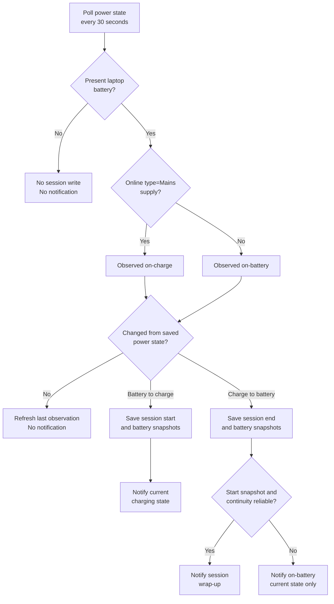

<!-- markdownlint-disable MD013 -->

# Charging session experience

> **Purpose:** This document is the shared user-experience contract and
> developer handoff for power transitions. The notification behavior below is
> expected behavior; it is not implemented yet.

Live battery data comes from UPower. Session history comes from a 30-second
poller, so recorded transition times can be up to 30 seconds late.

## User experience at a glance

| Event | Notification | Widget after the transition |
| --- | --- | --- |
| Charger connects | Show the current charging state and identify which batteries are charging or held. | Show charging state, combined level, charge rate, time to full, and current charge duration. |
| Charger disconnects | Show a concise session wrap-up: approximate duration, combined level gained, and the gain for each battery. | Show on-battery state, combined level, draw, remaining time, battery duration, and time since charging ended. |
| Session data is incomplete | Show only facts that are known. Do not estimate missing history. | Show `—` for unknown session values. |

## Notification information hierarchy

Notifications must answer the most useful question first. They must not repeat
every widget statistic.

### Charger connected

```text
Charging
BAT0 charging at 22% · BAT1 held at 80%
Combined 50% · 26 W · 42m to full
```

1. **Title:** `Charging`.
2. **Primary line:** Which battery is charging and which battery is held,
   full, unavailable, or not charging.
3. **Secondary line:** Combined level, current aggregate charge rate, and time
   to full when each value is available.

Do not show a session delta on connection. The session has only just started.

### Charger disconnected

```text
Charging ended
~18m · Combined 46% → 50% (+4 points)
BAT0 +10 points · BAT1 no change
```

1. **Title:** `Charging ended`.
2. **Primary line:** Approximate duration and combined start-to-end level.
3. **Secondary line:** Percentage-point change for each physical battery.

Use **percentage points**, not relative percentage. For example, 20% to 30%
is `+10 points`, not `+50%`.

After the next tracker observation, the widget shows `Battery <elapsed>` and
`Last <elapsed> ago`. When charging starts again, `Last` clears to `—`.

## Keep notifications concise

- Use no more than a title and two content lines where the notification system
  supports that layout.
- Put combined information before per-battery detail on disconnect.
- Include only present laptop batteries.
- Use `BAT0` and `BAT1`; do not expose serial numbers or host-specific IDs.
- Omit unavailable rate, duration, delta, or estimate values instead of showing
  misleading zeroes.
- Use `no change` for a reliable zero-point change.
- Use `~` for duration because polling makes transition times approximate.
- Do not notify again while the observed power state remains unchanged.

## One or more batteries

| Battery condition | Connection notification | Disconnection summary |
| --- | --- | --- |
| One battery | Identify that battery and its current state. | Show its start, end, and point gain. |
| Two batteries charging | Identify both as charging. | Show combined gain, then each battery's gain. |
| One charging, one held by threshold | Identify the charging battery first and the held battery second. | Show both; use `no change` for the held battery when reliable. |
| Battery present only at session start | Show it at connection. | Say `removed` with its start level; do not invent an end level or delta. |
| Battery present only at session end | It was not part of the connection snapshot. | Say `added` with its end level; do not invent a start level or delta. |
| No laptop battery | Do not create a session notification. | Keep the battery widget hidden. |

Session history belongs to the laptop's mains connection. It is not a separate
charging session for BAT0 and BAT1. Per-battery snapshots explain how the
combined session affected each battery.

## Transition flow



## Scenario and display map

| Event or condition | What is saved | What is displayed | Delay |
| --- | --- | --- | --- |
| First observation while charging | Current state; session start is unknown | Live charging state; session duration is `—` | Live data first; state within 30s |
| First observation on battery | Current state; session start is unknown | Live on-battery state; session duration is `—` | Live data first; state within 30s |
| Battery-to-charge transition | Charge start, combined level, and per-battery start snapshots | Connection notification; `Charge` begins | Up to 30s |
| Charge continues | Existing start is preserved; latest observation advances | Charge duration and live statistics continue | Widget refresh |
| Charge-to-battery transition | Charge end, duration, combined end level, and per-battery end snapshots | Wrap-up notification; `Battery` and `Last` begin | Up to 30s |
| Battery use continues | Existing charge end is preserved | Battery duration and `Last` continue | Widget refresh |
| Charger reconnects | New start snapshots; previous charge end clears | New connection notification; `Last` becomes `—` | Up to 30s |
| Same state after a gap over 90s | Current session start becomes unknown | Current duration is `—`; no historical claim | Next poll |
| Different state after an unknown gap | Current state is known, exact transition and duration are not | Current-state notification only; no wrap-up delta | Next poll |
| Empty refresh payload | Existing valid data remains | Last valid guarded widget values remain | Until a valid refresh |

## Data required for the expected notifications

The current state file is stored at:

```text
${XDG_STATE_HOME:-$HOME/.local/state}/battery-session/state
```

### Existing session fields

| Field | Meaning | Widget use |
| --- | --- | --- |
| `previous_state` | Last observed `on-charge` or `on-battery` state | Interprets the current session and hides `Last` while charging |
| `state_since` | Start of the current observed state, or `0` | Primary source for `Charge` or `Battery` duration |
| `last_charge_start` | Last observed battery-to-charge transition | Fallback source for charge duration |
| `last_charge_end` | Last observed charge-to-battery transition, or `0` | Source for `Last` while on battery |
| `last_observed` | Last successful tracker observation | Detects clock reversal or a gap over 90 seconds |

### Additional session snapshot required

The unplug wrap-up requires one start snapshot that survives until the session
ends:

| Value | Capture time | Requirement |
| --- | --- | --- |
| Session start epoch | Observed battery-to-charge transition | Use the poll time and mark the displayed duration approximate. |
| Combined start level | Session start | Store the aggregate percentage used by the widget. |
| Per-battery start level | Session start | Store `BAT*` name, percentage, and presence only. |
| Combined end level | Observed charge-to-battery transition | Capture before creating the wrap-up. |
| Per-battery end level | Session end | Match by `BAT*` name and handle added or removed batteries explicitly. |

Do not store serial numbers, model-specific identifiers, credentials, or other
host data. Write snapshots atomically with user-only permissions, as with the
current state file.

## Acceptance examples

| Input | Expected concise output |
| --- | --- |
| BAT0 charges from 12% to 22%; BAT1 stays at 80%; 18-minute session | `~18m · Combined 46% → 50% (+4 points)` then `BAT0 +10 points · BAT1 no change` |
| Both batteries charge | Combined summary, then one point gain for BAT0 and one for BAT1 |
| Start snapshot missing | `On battery · 50%` with no duration or delta claim |
| End estimate unavailable | Keep the wrap-up; omit time-remaining data |
| Charger reconnects | Show current charging batteries; clear `Last`; begin a new snapshot |
| Repeated on-charge poll | No notification |

## Developer handoff: current test map

| Behavior | Current automated coverage |
| --- | --- |
| Alternate mains name with `type=Mains` | Yes |
| Battery-to-charge transition | Yes |
| Charge-to-battery transition | Yes |
| Reconnect clears `last_charge_end` | Yes |
| Same-state gap over 90 seconds | Yes |
| Desktop without a battery | Yes |
| Two-battery aggregation | Yes, model-level |
| Threshold calculation | Yes, model-level |
| Exact notification content | No; notification feature is not implemented |
| Start and end battery snapshots | No; snapshot persistence is not implemented |
| Added or removed battery during a session | No |
| Real T480 AC and USB-C supplies | Manual/community verification |

## Visual review assets

Mermaid diagrams render directly on GitHub. Runtime screenshots belong under
[`docs/images/`](images/). Use the image guide there for filenames, privacy,
and expected captures.
