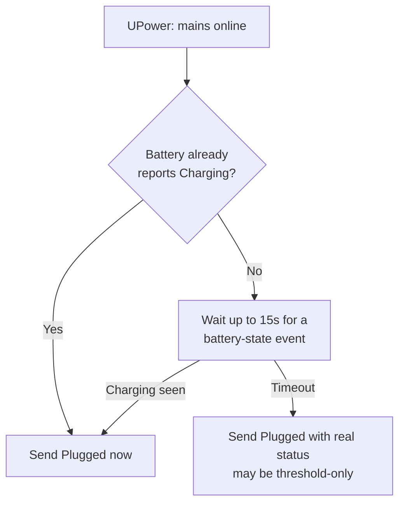
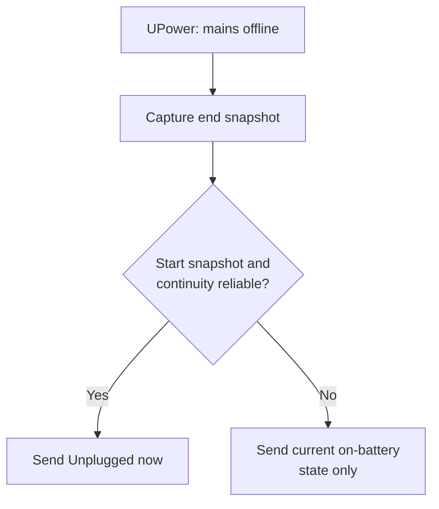

# Architecture

Audience: contributors changing the tracker, the monitor, or the panel.

## Two data sources

| Source | Drives | Frequency |
| --- | --- | --- |
| UPower events | Every notification | On mains connect/disconnect only |
| Poll (`battery-session-tracker.timer`) | Panel's live numbers | Every 30s |

The poll never sends a notification — it only refreshes the state file. A
panel value can lag reality by up to 30s. A notification never lags.

## Plug flow

The 15s wait exists because a battery already above its charge threshold
never reports `Charging`. Without it, the notification could fire before
UPower updates the battery's status and wrongly claim nothing is charging.
The timeout guarantees a notification still arrives.

## Unplug flow

Unplug settles fast (0.22s-0.65s on a T480), so this path never waits.

## Battery intelligence

The tracker samples aggregate `energy_now` and usable capacity every 30 seconds
while on battery. After 15 continuous active minutes it records a discharge
window in the versioned user-only history file. Gaps over 90 seconds, charging,
energy increases, implausible draw, missing measurements, and battery-topology
changes invalidate only the active window.

The model retains up to 96 valid windows for 180 days, but calculates `Usual`
from only the most recent 30 days. It requires 12 windows across 3 discharge
sessions and uses the median draw, then projects from the battery's current
usable capacity. Thus `Usual` is a full-charge active-runtime estimate that
adapts to battery health and recent usage.

## Two scripts, one state file

| Script | Runs | Job |
| --- | --- | --- |
| `battery-session-tracker` | Every 30s, and once per power event | Reads sysfs, updates the state file. Notifies only when called with `--power-event`. |
| `battery-session-monitor` | Continuously, as a systemd service | Watches `upower --monitor`, decides when a transition is real, calls the tracker with `--power-event`. |

Only `battery-session-monitor` passes `--power-event`. A notification
always traces back to a real UPower event, never to the poll. See the
[state file reference](state-file-reference.md) for field-level detail.

## Open edge cases

These transitions aren't covered by a flow above because the current
implementation doesn't define one. Treat them as backlog, not behavior —
see [requirements spec](requirements-spec.md) for tracking.

- **Suspend / resume.** No defined behavior for a mains change that happens
  while the system is suspended. The state file may show a stale
  `state_since` on resume.
- **Shutdown / poweroff mid-session.** No flush-on-shutdown path exists.
  A charging session in progress at shutdown leaves the state file at its
  last poll, up to 30s stale, and the next boot reads that stale state.
- **Last battery removed at runtime.** The tracker already reports a
  battery removed mid-session (see the notifications doc), but full
  desktop-mode fallback — no battery present at all after boot — is only
  handled at install-time preflight, not at runtime.

Each of these is a data-consistency question: does the state file, on the
next observation, correctly distinguish "stale from a gap" from "a real
new session"? The 90-second same-state gap rule (see the state file
reference) covers ordinary gaps; suspend and shutdown gaps can be much
longer and need their own review before they're called handled.
