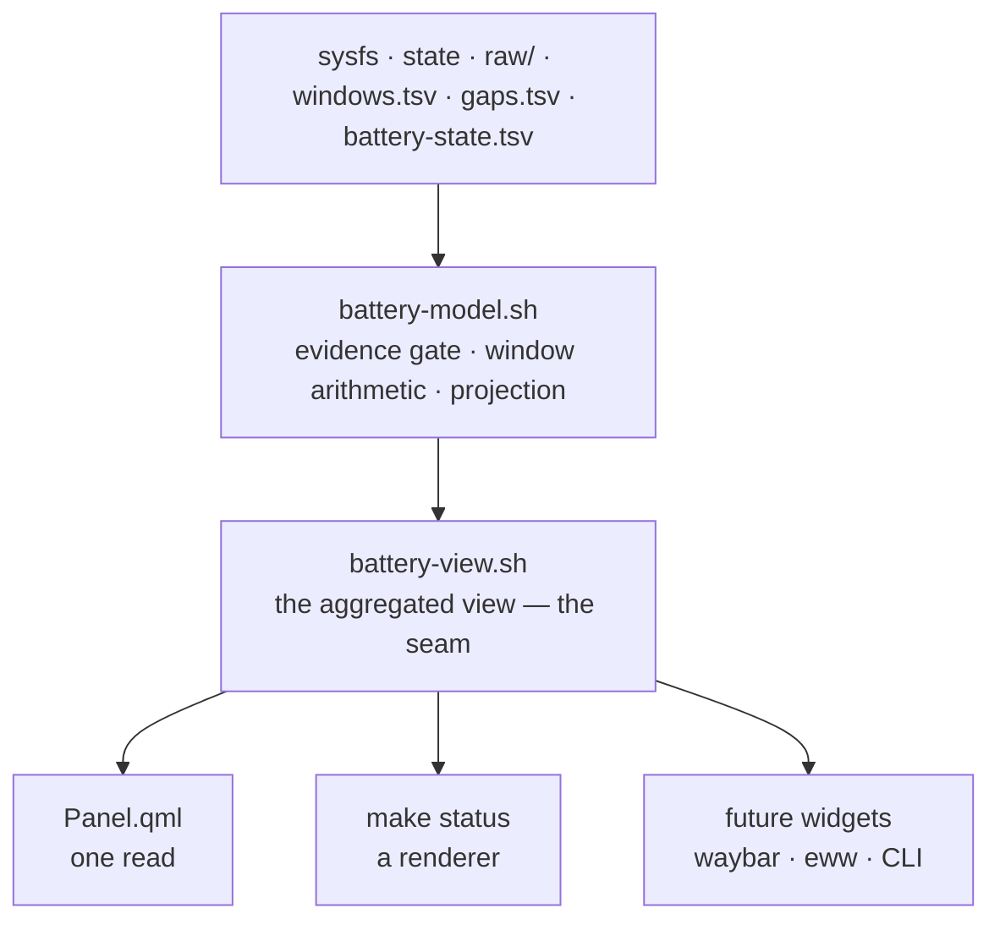
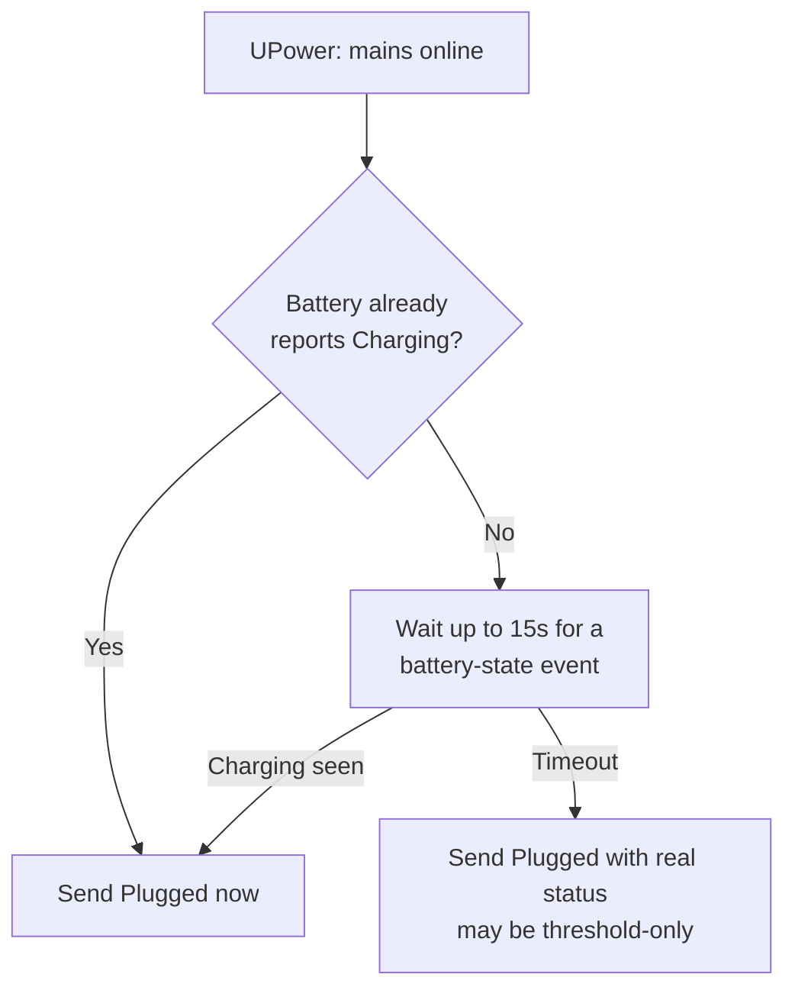
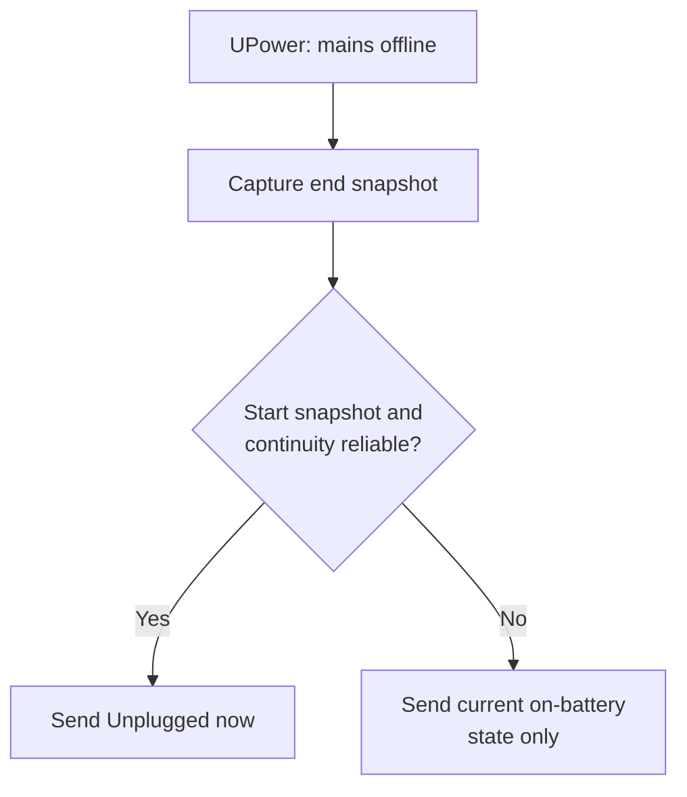

# Architecture

Audience: contributors changing the tracker, the monitor, or the panel.

## One producer, one view, many consumers

Everything a consumer needs about this machine's power state is computed in one
place and handed out as one versioned document.

`service/battery-model.sh` owns every rule the model depends on: the poll
interval and its gap tolerance, the 15-minute window, the 30-day lookback, the
180-day retention, the evidence gate, the plausibility bounds, and the
projection formula. Each is written down exactly once, so the tracker, the view
and the status report cannot drift apart — which they had, on the gate and on
the median, when the rules existed twice.

`service/battery-view.sh` is the only thing that computes the view.
`Panel.qml` reads it, `make status` sources it, and any future non-Omarchy
widget reads the same document. The view is derived output, never a second
source of truth: **if a consumer needs a field the view lacks, add it to the
view** rather than letting that consumer read the state file or sysfs
directly. That leak is exactly what the seam exists to prevent.

See the [view reference](view-reference.md) for the document itself.

## Two data sources

| Source | Drives | Frequency |
| --- | --- | --- |
| UPower events | Every notification | On mains connect/disconnect only |
| Poll (`battery-session-tracker.timer`) | Sampling windows and session timing | Every 3 minutes |
| UPower D-Bus properties | The panel's live battery numbers | Pushed, no polling |

The poll never sends a notification — it only advances the sampling window and
refreshes the state file. A notification never lags.

The poll is deliberately far slower than the 15-minute window it feeds: nothing
time-sensitive depends on it, because `battery-session-monitor.sh` already
event-triggers on every real AC transition and the panel's live numbers come
from UPower over D-Bus. `BATTERY_MODEL_POLL_INTERVAL_SECONDS` and the timer's
`OnUnitActiveSec` are two halves of one number and must be changed together;
the tracker's suspend/clock-gap tolerance is derived from it.

## Plug flow

The 15s wait exists because a battery already above its charge threshold
never reports `Charging`. Without it, the notification could fire before
UPower updates the battery's status and wrongly claim nothing is charging.
The timeout guarantees a notification still arrives.

## Unplug flow

Unplug settles fast (0.22s-0.65s on a T480), so this path never waits.

## Session timing confidence

Session timing is separate from battery intelligence. A real AC transition
provides an exact `state_since`, and the panel shows a plain duration such as
`5m`. When the transition itself was not observed, the tracker can only
establish a lower bound and the panel shows `> 5m`, meaning **at least five
minutes**.

| Tracker observation | Confidence | Panel |
| --- | --- | --- |
| Real AC/battery transition | Exact start | `X` |
| First run while already plugged or unplugged | Lower bound from first observation | `> X` |
| Same state after a polling gap over the tolerance or clock reversal | Lower bound from first post-gap observation | `> X` |
| Existing state has no valid session timestamp | Lower bound from recovery observation | `> X` |
| Next real transition after any lower-bound state | Exact start restored | `X` |

The tracker persists this distinction in `state_since_at_least`; see the
[state file reference](state-file-reference.md#session-duration-confidence).

## Raw observations, and one extractor

[ADR-0001](adr/0001-raw-observation-tier.md) is the design record for this
section; this is the summary a contributor changing the tracker actually
needs.

Every poll, for every battery, appends one row to that battery's own
`raw/<battery-key>/<date>.tsv` file — unconditionally, whether or not it
completes a window. That row is the liveness proof: it is what lets a later
gap be explained rather than merely noticed. A transition row (AC-online
flip, or a battery's status string changing) is written the same way,
filtered to real changes so a burst of duplicate UPower events collapses to
one row.

`battery_extract_windows()` in `service/battery-model.sh` turns raw rows into
`windows.tsv` and `gaps.tsv`. It is called two ways — incrementally, on a
bounded tail after every poll, and in batch, over the whole file, by
`make reextract` — and both call sites run the identical function. This is
the central guarantee of the whole design: window arithmetic, the
threshold-hold rule, and battery-identity handling had each drifted between
two implementations at different points before ADR-0001, and each drift
shipped a bug. One function, two call sites, removes the possibility.

Any two consecutive raw rows fully determine what happened between them.
`boot_id` and `suspend_count` deltas classify a gap as `off`
(shutdown/reboot/hibernate — a different boot), `asleep` (suspend — same
boot, `suspend_count` increased), or `blind` (the machine was awake, the
tracker was not running); a backward clock jump beyond ordinary NTP jitter
classifies as `clock`. A window that spans a gap is written and flagged
`eligible=0` — retained for reconstruction, never deleted, never counted as
evidence. See the [state file reference](state-file-reference.md) for the
column-level detail of all four tiers.

The tracker records evidence; it computes no estimate.

### One model per battery

Evidence is recorded, retained, and modelled **per battery**, anchored to that
cell's identity — vendor, model, and serial — rather than to its capacity,
which drifts with wear and calibration and so cannot identify anything.

A projection answers "how long will this cell last from where it is now", and
that depends on its own capacity, age, and discharge curve. Mixing a worn
battery's measurements with a healthy one produces a number describing neither,
so another battery's windows are never consulted. Evidence for a battery that
is no longer installed is reported by `make status` and never modelled.

These batteries discharge in sequence rather than together: while one supplies
the system the other sits idle. So an idle battery records nothing for that
window — a row of zeros would bury its real draw — and the pack figure is the
sum of the per-battery projections.

Retention is a read-time interpretation, not a write-time row cap: nothing in
`windows.tsv` is ever pruned, so a heavily used cell can never evict the
evidence of one swapped in only occasionally by filling a shared cap.

The view calculates from the most recent 30 days. A battery needs 12 windows
across 3 discharge sessions to be `ready`, and 4 to offer a `provisional`
estimate with an explicit low-confidence label rather than showing a new user
nothing for days. Alongside the point estimate it reports a p25–p75 band from
the same sorted draws — a heavier draw buys less time, so the p75 draw sets the
low edge.

### The estimator each battery uses

Several estimators compete: the median of its windows, the mean of its newest
few, an exponentially weighted average, and the previous window alone. The
tracker scores them against that battery's own held-out windows whenever it
records one, and writes the winner to that battery's row in
`battery-state.tsv`; every reader looks the answer up.

The cost is deliberately placed on the 15-minute window-append path rather than
the panel refresh, which reads the view every five seconds while open. Scoring
is far too expensive to repeat there, and the answer cannot change without a
new window.

The median is the incumbent and keeps the job unless a challenger beats it by a
clear margin. Scores drift window to window, so without a margin the choice
would flap between estimators separated by noise — and a projection that
silently changes shape is harder to trust than one consistently a little worse.

### Nothing ships on plausibility

`docs/research/battery-runtime-modelling.md` requires a measurable held-out
improvement before a model change ships. `scripts/battery-backtest.sh`
(`make backtest`) is the harness that produces it: for each battery it replays
that battery's windows in order and, at each one, predicts using only the
windows before it, then scores each candidate against the observed draw. `last`
— simply the previous window — is the naive baseline; an estimator that cannot
beat it is not learning anything.

The report and the running model share one implementation,
`battery_model_score_draws()`, so they cannot reach different verdicts. The
report also states the selection the tracker would make.

`make export` bundles `windows.csv`, `gaps.csv`, `battery-state.tsv`, a
manifest, and every battery's raw files into one zip, with identity split into
columns, for exploring a question in a notebook before committing it to
shell.

## Two scripts, one state file

| Script | Runs | Job |
| --- | --- | --- |
| `battery-session-tracker.sh` | Every 3 minutes, and once per power event | Reads sysfs, advances the sampling window, updates the state file. Notifies only when called with `--power-event`. |
| `battery-session-monitor.sh` | Continuously, as a systemd service | Watches `upower --monitor`, decides when a transition is real, calls the tracker with `--power-event`. |

Only `battery-session-monitor.sh` passes `--power-event`. A notification
always traces back to a real UPower event, never to the poll. See the
[state file reference](state-file-reference.md) for field-level detail.

## Operational status

`make status` is the sole operational report. It computes nothing: it sources
`battery-view.sh`, renders the view, and adds the one fact only an operator
report cares about — systemd service health. The view's direct sysfs read
distinguishes charging, full, and charge-threshold hold, and prevents stale
persisted state from masquerading as a present battery. It also separates a
power-supply tree that cannot be read at all from one that holds no battery.

The renderer applies lifecycle precedence rather than calling every failure
`learning`: no battery or unknown history is `unavailable`; completed evidence
without current energy is `blocked`; stale/current-clock data is `cached`; only
an incomplete evidence gate is `learning`. Tracker freshness and model
freshness are separate because a recently polled state can still use old
learned observations.

The default remains concise. `VERBOSE=1` adds state/history/window details for
collection diagnosis. Output is ANSI-colored on a terminal and plain when
redirected or when `NO_COLOR` is set. See the
[status output reference](status-output-reference.md) for the complete state and
field contract.

## Open edge cases

Suspend and shutdown gaps are handled now — see
[gap classification](#raw-observations-and-one-extractor) above and
[ADR-0001](adr/0001-raw-observation-tier.md). What is left is genuinely open,
not just undocumented:

- **A mains change that happens entirely within a gap.** If the machine is
  plugged in, suspended, unplugged, and resumed, the two raw rows bracketing
  the gap disagree on `ac_online` but the gap itself carries no observation
  of when the change happened. The gap is recorded and classified
  correctly; the precise moment of the flip inside it is not recoverable.
- **Last battery removed at runtime.** Status suppresses stale runtime when no
  present battery remains, and notifications report a mid-session removal.
  The panel's full desktop-mode fallback after the final runtime removal still
  needs real-hardware verification.

See [requirements spec](requirements-spec.md) for tracking.
