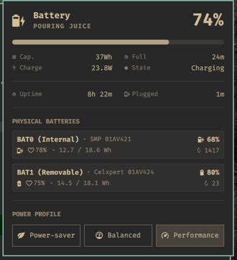
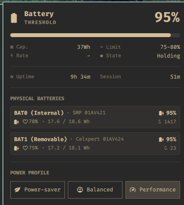
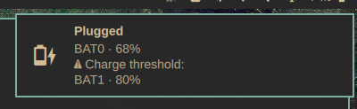
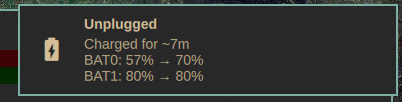

# What the panel and notifications tell you


The bar shows one combined percentage. Open the panel for per-battery
health, energy, cycles, and state. A notification fires only when the
charger connects or disconnects.

The panel's live battery numbers come from UPower over D-Bus and are pushed as
they change, so they do not lag. Session durations come from the tracker, which
polls every few minutes, so a shown duration can lag by that much.
Notifications never lag.

## `≈ Usual` runtime

`≈ Usual` projects how long the energy stored **right now** normally lasts. It
decreases with charge level. It is intentionally different from `Left`, which
reacts to the current workload and can move quickly.

Each battery is modelled from its own discharge windows — a worn cell and a
healthy one are never averaged together — and `≈ Usual` is the sum of those
per-battery projections. These batteries discharge one after another rather
than together, so adding them is what the pack actually gives you.

The panel shows a single combined figure on purpose. To see what each battery
contributes, and which one is still learning, run `make status`; see
[check battery and model health](status.md) for learning, blocked, stale,
charging, full, and charge-threshold states.

## Charger connected: `Plugged`



```text
Plugged
BAT0 · 22%
```

One row per battery that's actively charging, with its percentage. Two
charging batteries get two rows.

A battery held at its charge threshold doesn't show as charging — the panel
shows `Holding` and the configured limit, so you know why it isn't charging
instead of having to guess:



The same condition is also called out in the connection notification:



```text
Plugged
⚠ Charge threshold:
BAT0 · 95%
```

A battery only appears under `⚠ Charge threshold` once it has actually reached
its own configured limit. On a machine that charges its batteries in sequence,
the one waiting its turn reports the same "not charging" state as a battery
genuinely held at its cap, so it is listed plainly instead:

```text
Plugged
BAT1 · 42%
Not charging:
BAT0 · 70%
```

The notification never repeats numbers the panel already shows — no
aggregate pack level, charge rate, or time-to-full.

## Charger disconnected: `Unplugged`



```text
Unplugged
Charged for ~18m
BAT0: 12% → 22%
BAT1: 80% → 80%
```

The first line is the approximate session duration. Each battery gets one
start-to-end row. A battery that didn't move (already at its threshold)
still gets a row — equal start and end values already say "no change."

## Rules that apply to every notification

- One short title, one scannable fact per row.
- Only present laptop batteries appear — never a UPS or the AC adapter.
- Batteries are named `BAT0`, `BAT1`, and so on — never a serial number.
- An unknown value is omitted, never shown as a misleading zero.
- The same power state never sends a notification twice.
- A plug shorter than the battery's settle time sends only `Unplugged` —
  a connection that stops before any battery starts charging isn't an
  event worth reporting.

## Battery added or removed mid-session

| Case | On connect | On disconnect |
| --- | --- | --- |
| Battery present for the whole session | Shown with its percentage | Start → end row |
| Battery removed mid-session | Shown at connect | Row reads `removed`, with its last known level |
| Battery added mid-session | Not in the connect snapshot | Row reads `added`, with its level |
| No laptop battery | No notification | Panel stays hidden |

## Panel session duration

The panel distinguishes an observed transition from a session that was
already underway when tracking became reliable:

| Display | Meaning |
| --- | --- |
| `5m` | The tracker observed the plug or unplug transition five minutes ago |
| `> 5m` | **At least five minutes**; the actual session started earlier, but its transition time is unknown |

The `>` form appears when the tracker first starts while already plugged or
unplugged, resumes the same state after a polling gap beyond the tracker's
tolerance or a clock reversal, or recovers an older state file with no session
timestamp. It
disappears after the next real plug or unplug transition.

For the mechanics behind this — the state machine, timing, and state file —
see [architecture](../dev/architecture.md).
